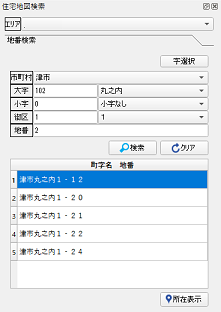
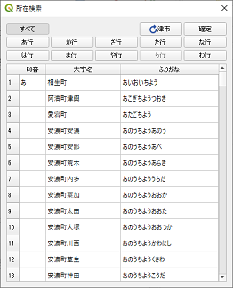
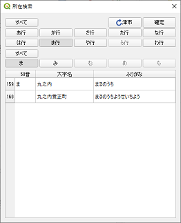
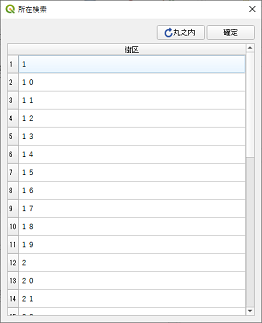

# 住宅地図検索プラグイン 利用マニュアル

## 起動
プラグインメニューから「住宅地図検索」をクリックします。 
すると、下記のようなデータベース情報設定ダイアログ画面が表示されます。

## データベース情報設定
データベース情報を入力します。 
conf.iniファイルに記載されている場合は、該当項目は表示されません。 
「OK」ボタンをクリックして接続します。

接続中は下記メッセージが表示されます。

## 地番検索
接続が完了すると、左側に下記のような地番検索が表示されます。 
選択したエリアの市区町村～地番までを指定して検索します。

|    |    |
| ---- | ---- |
| エリア |  データベース内のスキーマ名  |
| 市町村 |  選択したエリアの市町村 （必須）|
| 大字(数値) |  選択した大字の番号。入力すると該当する大字が選択される（ない場合はクリアされる）|
| 大字 |  選択した市区町村内の大字 （必須）|
| 小字(数値) |  選択した小字の番号。入力すると該当する小字が選択される（ない場合はクリアされる）|
| 小字 |  選択した大字内の小字（小字がない場合は「小字なし」と表示される）  |
| 街区 |  選択した小字内の街区（街区がない場合は「街区なし」と表示される）  |
| 地番 |  地番の入力欄。入力すると「所在表示ボタン」が「検索ボタン」になる |
| 字選択ボタン |  字選択ダイアログを表示  |
| 所在表示ボタン |  選択している地域にズーム移動する  |
| 検索ボタン(地番入力時）) |  地番が検索され一覧に表示される  |
| クリアボタン |  選択内容をクリアする  |

地番を指定すると該当する地番が一覧表示されます。

「所在表示ボタン」を押すと、選択した名称（大字～地番）の位置にズームされます。
（地理院地図：http://cyberjapandata.gsi.go.jp/）

## 字選択

50音ボタンで大字、小字を抽出して選択します。

|    |    |
| ---- | ---- |
| すべて |  50音指定が解除されて表示されます|
| 戻る（ここでは”津市”） |  上位に戻ります|
| 確定 |  一覧から選択せず、地番検索ウィンドウに反映します|
| 50音(行) |  指定した行に該当する内容が抽出されます|
| 50音(段) |  指定した文字に該当する内容が抽出されます|

「ま」を選択した場合

「丸の内」を選択した場合

「確定」ボタンを押すと、地番検索ウィンドウに反映されます。

## ランドマーク検索

開発中

