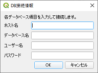
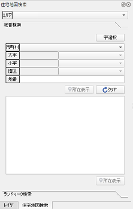
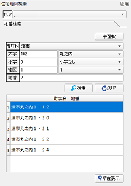
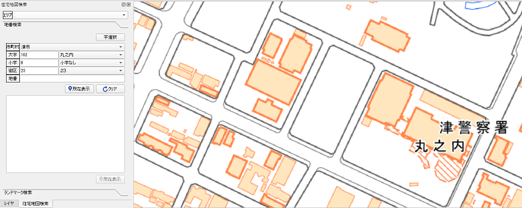
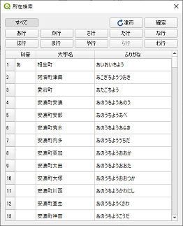
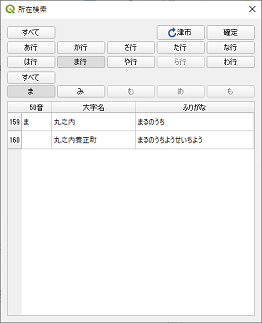
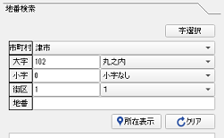

# 住宅地図検索プラグイン

データベースに登録された住宅地図情報から所在検索するQGISプラグインです。

## 概要

### データベース情報設定
データベース情報を入力し接続

### 地番検索
選択したエリアの市区町村～地番までを検索して表示

地番を指定して該当する地番を一覧表示

選択した名称（大字～地番）の位置にズーム
（地理院地図：http://cyberjapandata.gsi.go.jp/）

### 字選択

50音ボタンで大字、小字を抽出して選択

地番検索ウィンドウに反映

### ランドマーク検索

開発中

## 利用方法

利用方法については、[使い方](./MANUAL.md)をご確認ください。

## ライセンス

本ツールは GNU GENERAL PUBLIC LICENSE v2 ライセンスが設定されています。[GNU GENERAL PUBLIC LICENSE Version 2, June 1991](https://www.gnu.org/licenses/old-licenses/gpl-2.0.txt)
